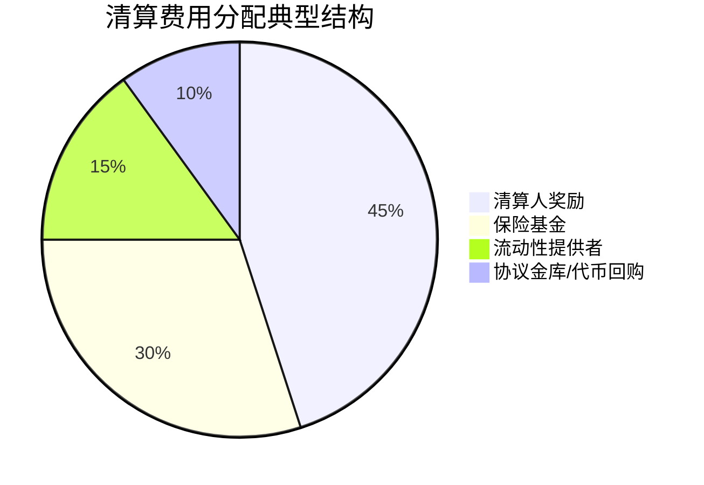

### 风险管理与安全性

| 序号 | 问题描述 | 问题状态 |
|------|----------|----------|
| 61 | [Perp DEX 面临哪些主要风险？（智能合约风险、预言机风险、LP 风险、清算风险、经济模型风险、审查风险）](#61-perp-dex-面临的主要风险) | ⏳ 待完善 |
| 62 | [如何防范智能合约漏洞？除了审计和 Bug Bounty，还有哪些措施？](#62-智能合约漏洞防范) | ⏳ 待完善 |
| 63 | [如何应对闪贷攻击（Flash Loan Attack）？例如在价格预言机或清算过程中？](#63-闪贷攻击应对) | ⏳ 待完善 |
| 64 | [清算机制如何确保公平、透明和高效？](#64-清算机制公平性) | ⏳ 待完善 |
| 65 | [是否存在清算机器人？它们如何参与清算过程？](#65-清算机器人参与) | ⏳ 待完善 |
| 66 | [清算人如何获得激励？清算费用如何分配？](#66-清算人激励与费用分配) | ⏳ 待完善 |
| 67 | [如何避免清算过程中的抢跑（Front-Running）？](#67-避免清算抢跑) | ⏳ 待完善 |
| 68 | [是否有保险基金或安全模块来保护 LP 或交易者免受极端损失？](#68-保险基金与安全模块) | ⏳ 待完善 |
| 69 | [保险基金的资金来源是什么？由谁管理？如何触发赔付？](#69-保险基金运作机制) | ⏳ 待完善 |
| 70 | [如何防止价格操纵，特别是通过闪电贷或低流动性交易对？](#70-防止价格操纵) | ⏳ 待完善 |
| 71 | [如何处理极端市场波动，如"黑天鹅事件"或"死亡螺旋"（Death Spiral）？](#71-极端市场波动处理) | ⏳ 待完善 |
| 72 | [Perp DEX 如何应对区块链网络拥堵或 Gas 费用飙升？](#72-网络拥堵与gas费用应对) | ⏳ 待完善 |
| 73 | [协议是否有应急停止开关（Pause Function）？在什么条件下可以激活？](#73-应急停止开关) | ⏳ 待完善 |
| 74 | [谁拥有激活应急停止开关的权限？](#74-应急停止开关权限) | ⏳ 待完善 |
| 75 | [是否有风险参数可供治理调整？例如维持保证金率、清算惩罚、最大杠杆倍数、资金费率间隔？](#75-风险参数治理调整) | ⏳ 待完善 |
| 76 | [协议如何监控自身的健康状况和潜在风险？](#76-协议健康监控) | ⏳ 待完善 |
| 77 | [是否有风险仪表盘（Risk Dashboard）供用户查看关键指标？](#77-风险仪表盘) | ⏳ 待完善 |
| 78 | [协议如何处理无常损失（Impermanent Loss）对 LP 的影响？](#78-无常损失应对) | ⏳ 待完善 |
| 79 | [是否有机制来应对巨额或恶意头寸对流动性池的影响？](#79-巨额恶意头寸应对) | ⏳ 待完善 |
| 80 | [Perp DEX 如何处理与外部协议（如借贷协议）的潜在交互风险？](#80-外部协议交互风险) | ⏳ 待完善 |

---

## 61. Perp DEX 面临的主要风险
**问题**: Perp DEX 面临哪些主要风险？（智能合约风险、预言机风险、LP 风险、清算风险、经济模型风险、审查风险）
**English**: What are the main risks faced by Perp DEX? (smart contract risks, oracle risks, LP risks, liquidation risks, economic model risks, censorship risks)

永续去中心化交易所（Perp DEX）在提供链上杠杆交易的同时，也伴随着一系列独特的风险。为了让你能快速了解其核心风险，我先把它们汇总在下面的表格里，然后再展开说明。

| 风险维度 | 核心问题 | 潜在影响 |
| :--- | :--- | :--- |
| **🛡️ 智能合约风险** | 代码漏洞、不安全的合约升级 | 资金被盗或永久锁定 |
| **🔮 预言机与数据风险** | 价格操纵、数据源单一或失效 | 不公平清算、市场被操控 |
| **💧 流动性与经济模型风险** | 流动性假象、激励不可持续、LP承担对手方风险 | 高滑点、协议流动性枯竭、LP亏损 |
| **⚖️ 治理与操控风险** | 权力中心化、选择性干预、市场操纵 | 治理不公、用户利益受损 |
| **🌀 清算与执行风险** | 机制不透明、不公平清算 | 用户意外损失、连锁反应 |

---

### 🛡️ 智能合约风险

智能合约是Perp DEX的基石，但其复杂性也带来了固有威胁。
*   **代码漏洞与升级风险**：尽管协议经过审计，但智能合约中未被发现的**逻辑漏洞或错误**仍可能被利用，导致灾难性的资金损失。此外，如果协议可通过治理升级，**不安全的升级过程**本身也可能成为攻击载体。

### 🔮 预言机与数据风险

Perp DEX严重依赖链下数据来定价和清算，这使得预言机成为关键风险点。
*   **价格操纵与数据失效**：攻击者可能通过操纵低流动性资产的价格，**扭曲预言机数据**，从而触发不公平的清算或进行套利。一个典型案例是2025年8月Hyperliquid上的XPL事件，操控者利用其独立的预言机定价，将价格短时间内推高200%，导致大量空头头寸被清算。
*   **数据源中心化**：过度依赖单一或少数几个预言机供应商，会创建一个**中心化的故障点**。如果该数据源因网络拥堵或其他原因停止更新或提供过时数据，协议将依据不准确的价格运行，给用户造成损失。

### 💧 流动性与经济模型风险

这是Perp DEX当前面临的最严峻挑战之一，直接关系到协议的生存能力。
*   **流动性假象与同质化竞争**：许多协议用高额代币激励吸引流动性，但这可能制造**流动性假象**。一旦激励减少，资本可能迅速撤离。整个赛道**同质化严重**，新协议大多通过更高杠杆、更低手续费和更多空投来竞争，导致平台间互相蚕食用户，而非扩大整体市场。
*   **不可持续的激励与LP风险**：BitMEX首席执行官Stephan Lutz直言，这种严重依赖激励的商业模式本质上是**脆弱且不可持续**的，可能只是一种吸引注意力的短期策略。在GMX等聚合流动性池模型中，流动性提供者（LP）直接充当所有交易者的**对手方**。如果交易者整体盈利，LP的资金池就会持续失血。

### ⚖️ 治理与操控风险

“去中心化”的外衣下，权力和资本可能高度集中。
*   **治理中心化与选择性干预**：尽管声称由社区治理，但大量治理代币往往集中在团队、VC和早期投资者手中，导致**治理权力中心化**。更值得警惕的是**选择性干预**。例如，Hyperliquid在JELLY事件中为保护平台金库迅速干预市场，但在造成用户更大损失的XPL事件中却以“协议按设计运行”为由不予介入，这暴露了平台利益与用户利益冲突时的**双重标准**。
*   **市场操控与结构性不公**：透明的链上订单簿使大额交易者的**止损线和清算价格暴露无遗**，容易遭到恶意狙击。此外，协议内部可能存在结构性不公，例如Hyperliquid的协议金库（HLP）在清算处理权和费用分成上享有普通用户金库无法比拟的优势，形成了“特权阶层”。

### 🌀 清算与执行风险

清算机制是维护系统偿付的关键，但其自身也存在显著风险。
*   **黑箱操作与不公平清算**：部分平台的清算机制**缺乏透明度**，用户难以验证清算价格的合理性。在市场剧烈波动或出现预言机问题时，交易者可能遭遇**不公平的清算**，蒙受意外损失。

---

### 💎 总结与建议

面对这些风险，无论是交易者还是流动性提供者，都需要保持警惕：
*   **对于交易者**：应**谨慎使用高杠杆**，并清楚了解所用平台的预言机来源和清算机制。对于透明度低、流动性差的新兴资产更要格外小心。
*   **对于流动性提供者（LP）**：需要**深入理解协议的经济模型**，警惕那些完全依赖高通胀代币激励的协议。在参与聚合池前，务必明白你是在与整个市场的交易者对赌。


---

## 62. 智能合约漏洞防范
**问题**: 如何防范智能合约漏洞？除了审计和 Bug Bounty，还有哪些措施？
**English**: How to prevent smart contract vulnerabilities? Besides audits and bug bounties, what other measures are there?

### 🛡️ 智能合约漏洞纵深防御体系

除了安全审计和漏洞赏金，智能合约安全需要建立覆盖全生命周期的防御体系。以下是关键防护措施：

#### 💻 开发阶段防护

| 防护措施 | 具体实践 | 安全价值 |
|---------|----------|----------|
| **标准化组件** | 使用OpenZeppelin等经过验证的库 | 避免重写基础功能引入漏洞 |
| **代码简约化** | 复杂逻辑分解为简单函数 | 减少漏洞藏匿空间，便于审查 |
| **现代编译器** | 使用Solidity 0.8.x+版本 | 自动溢出保护等内置安全特性 |
| **安全设计模式** | Checks-Effects-Interactions模式 | 有效防御重入攻击 |
| **全面测试** | 单元测试+集成测试+模糊测试 | 覆盖正常与边界情况 |

**关键开发实践**：
- 🔄 **CEI模式**：先检查→再更新状态→最后外部调用
- 🚨 **紧急停止**：内置断路器机制，危急时暂停关键功能
- 🎯 **模糊测试**：使用Echidna等工具进行随机输入测试

#### 🚀 部署阶段防护

**可升级性与管理安全**
- 🔄 **代理模式**：通过代理合约实现逻辑升级，修复漏洞不影响用户资产
- 👥 **多签授权**：关键操作需要多个独立方批准
- ⏰ **时间锁机制**：重大操作延迟执行，留出社区响应时间

> 部署安全如同**建筑工程的验收环节**——即使设计图纸完美，施工过程也需要多重监督和质量检查。

#### 📊 持续监控阶段

**实时风控体系**
- 🤖 **自动化流水线**：CI/CD中集成安全测试，每次提交自动扫描
- 🔍 **链上监控**：使用Tenderly等工具监控异常交易模式
- 🧠 **AI辅助分析**：利用QuillAI等工具识别潜在逻辑错误
- 📈 **异常检测**：监控意外余额变化、异常Gas消耗等指标

#### 🏛️ 组织与流程保障

**深度安全实践**
- 📐 **形式化验证**：对核心财务逻辑进行数学证明（最高安全级别）
- 👁️ **内部代码审查**：定期团队内交叉审查，确保符合最佳实践
- 📚 **持续学习**：跟踪最新漏洞模式，从历史事件中学习

### 防御体系核心原则

**分层防御**：
- 不要依赖单一安全措施
- 每层都提供独立防护价值
- 层层叠加构建深度防御

**安全左移**：
- 在开发最早阶段考虑安全
- 提前发现和修复成本最低
- 自动化工具辅助早期检测

**透明与验证**：
- 所有安全措施应可验证
- 社区参与增强信任度
- 公开安全实践接受监督

这套纵深防御体系确保了从代码编写到线上运行的全流程防护，大幅提升了智能合约的安全性——在DeFi世界，**安全不是功能，而是基础**。

---

## 63. 闪贷攻击应对
**问题**: 如何应对闪贷攻击（Flash Loan Attack）？例如在价格预言机或清算过程中？
**English**: How to deal with flash loan attacks? For example, in price oracles or liquidation processes?

### 🛡️ Perp DEX 闪电贷攻击防御策略

闪电贷攻击通过单笔交易借入巨额资金操纵市场，Perp DEX 需在价格预言机和清算流程两个关键领域建立多层防御。

#### ⚖️ 价格预言机防护

| 防御策略 | 实现机制 | 防护效果 |
|---------|----------|----------|
| **TWAP/VWAP均价** | 使用时间/交易量加权平均价格 | 大幅提升短期操纵成本，攻击需维持整个时间窗口 |
| **多源预言机** | 聚合Chainlink等多个独立数据源 | 消除单点故障，防止单一数据源被操纵 |
| **价格偏差检查** | 设置价格波动阈值，异常时暂停功能 | 紧急制动机制，防止剧烈波动破坏系统 |

**关键实践**：
- Uniswap V3的TWAP预言机已证明对抗闪贷操纵的有效性
- 从bZx事件吸取教训，避免依赖单一DEX作为价格源

#### 💰 清算流程加固

**头寸管理**
- 📏 **最低抵押要求**：防止用户抽干抵押品制造清算漏洞
- 🎯 **头寸规模限制**：避免大量"垃圾头寸"淹没清算系统

**清算优化**
- 🔄 **部分清算机制**：大额头寸分批清算，提升执行成功率
- 💸 **动态清算费用**：提高攻击者成本，削弱盈利空间
- ⚡ **实时监控预警**：检测异常交易模式，及时触发熔断机制

**系统韧性**
- 🏦 **坏账处理预案**：通过保险基金或LP共担机制吸收残余损失
- 🔒 **并发攻击防护**：确保清算逻辑能处理同时发生的多个清算交易

> 防御闪电贷如同**构建金融系统的安全网**——既要有预警雷达（预言机防护），又要有应急机制（清算加固），还得有最后的保险丝（熔断措施）。

### 综合防御体系价值

**经济威慑**：
- 通过提高攻击成本让绝大多数闪贷攻击无利可图
- 动态费用和头寸限制形成天然屏障

**技术防护**：
- 多时间维度的价格数据减少操纵窗口
- 实时监控提供主动防御能力

**系统韧性**：
- 部分清算和坏账处理确保极端情况下系统存活
- 多层防护避免单点失效

这套组合防御策略使得Perp DEX能够在享受DeFi开放性的同时，有效抵御闪电贷带来的独特攻击向量，为用户资金提供坚实保障。

---

## 64. 清算机制公平性
**问题**: 清算机制如何确保公平、透明和高效？
**English**: How does the liquidation mechanism ensure fairness, transparency and efficiency?

### ⚖️ Perp DEX 清算机制：公平、透明与效率

与传统中心化交易所的黑箱操作不同，Perp DEX 通过链上设计确保了清算流程的可验证与去中心化。

#### 🔍 透明度保障

| 透明维度 | 实现方式 | 用户价值 |
|---------|----------|----------|
| **链上可追溯** | 所有清算交易在区块链公开记录 | 任何人可验证触发价格、头寸细节和执行时间 |
| **开源逻辑** | 清算智能合约代码完全开源 | 社区可审查规则，确保无隐藏偏见 |
| **预言机可验** | 使用去中心化预言机数据 | 防止价格操纵，数据来源公开可查 |
| **加密交易** | FAIR等协议探索交易隐藏技术 | 防止机器人"狙击"清算，提升公平性 |

#### ⚖️ 公平性设计

**去中心化防护**
- 🌐 **多源预言机**：聚合多个独立价格源，抗单一数据操纵
- 👥 **开放清算网络**：无需许可参与，防止清算权集中
- 📉 **部分清算机制**：仅清算至安全水平，减少过度惩罚

**风险缓冲机制**
- 🛡️ **保险基金**：由协议收入资助，覆盖极端情况下的坏账
- 🔄 **渐进式清算**：避免大额清算对市场造成冲击

#### 🚀 效率优化

**自动化执行**
- ⚡ **智能合约触发**：保证金低于阈值时自动执行，无需人工
- 💰 **清算人激励**：奖励覆盖Gas成本并提供利润，确保网络活跃

**技术架构支撑**
- 🏗️ **Layer-2部署**：Arbitrum等网络提供高吞吐、低Gas环境
- 🔧 **Gas优化**：单交易多清算，提升网络拥堵时的执行效率

> Perp DEX清算如同**公开的司法程序**——规则透明（链上可查）、法官中立（去中心化预言机）、执行高效（自动化激励），相比CEX的"黑箱操作"更值得信赖。

### ⚠️ 现存挑战与演进

**技术局限性**
- 🤖 **MEV风险**：透明性导致清算交易可能被机器人抢跑
- ⏰ **预言机延迟**：网络拥堵时价格更新滞后可能影响清算准确性
- 🌊 **网络拥堵**：极端行情下清算交易可能延迟执行

**持续创新方向**
- 🔒 **加密技术应用**：隐藏交易细节同时保持最终结算透明
- 📊 **多维度风控**：结合更多指标优化清算触发机制
- 🌐 **跨链互操作**：利用多链生态分散风险提升韧性

### 实践启示

**对交易者**：
- 选择采用TWAP预言机、有保险基金的协议
- 关注清算规则透明度高的平台
- 合理设置止损，避免在流动性不足时使用高杠杆

**对清算参与者**：
- 需要专业机器人和Gas优化策略
- 关注各协议激励机制的可持续性
- 分散到多个协议以降低单点风险

Perp DEX 的清算机制通过技术手段实现了传统金融难以企及的透明度与公平性，虽然仍需完善，但已展现出去中心化金融的独特优势。

---

## 65. 清算机器人参与
**问题**: 是否存在清算机器人？它们如何参与清算过程？
**English**: Do liquidation bots exist? How do they participate in the liquidation process?

### ⚙️ 清算机器人运作全解析

清算机器人是Perp DEX生态系统中不可或缺的"清道夫"，通过自动化程序确保协议偿付能力。

#### 🔍 运作流程

**监控与识别**
- 📊 **实时监控**：持续扫描链上数据，追踪账户健康因子
- 🔔 **事件订阅**：监听协议事件流，高效重建用户头寸状态
- 📈 **价格预警**：密切关注预言机价格突变，预测潜在清算目标

**验证与执行**
- 💰 **盈利测算**：预先计算Gas成本、滑点、清算奖励，确保净利润
- ⚡ **快速提交**：识别有利可图头寸后立即构建并提交清算交易
- 🏃 **竞争策略**：通过私有交易或MEV中继避免被抢跑

**进阶技巧**
- 🔄 **原子操作**：利用闪电贷在单笔交易中完成借-清算-还全流程
- 🎯 **Gas优化**：在网络拥堵时优先处理高价值清算机会

> 清算机器人就像**金融市场的秃鹫**——嗅觉敏锐、行动迅速，专门清理市场中的"腐肉"（风险头寸），既维护生态健康又从中获利。

#### ⚖️ 生态角色与影响

**积极价值**
| 角色定位 | 生态贡献 | 协议依赖 |
|---------|----------|----------|
| **风险管理者** | 及时清除坏账，维护协议偿付能力 | 高 |
| **市场平衡者** | 惩罚过度杠杆，促进理性交易 | 中 |
| **效率提升者** | 自动化执行，远超人脑反应速度 | 高 |

**现存挑战**
- 🤖 **MEV争夺战**：机器人间激烈竞争导致Gas费飙升
- 🎯 **抢跑攻击**：透明性让清算交易暴露在MEV机器人面前
- 🌪️ **闪电贷滥用**：攻击者操纵价格制造不公平清算机会

#### 💡 参与洞察

**对于普通用户**
- ⚠️ **风险认知**：理解高杠杆头寸在波动市场中易成为机器人目标
- 🛡️ **风控措施**：设置合理止损，维持充足保证金缓冲
- 📊 **协议选择**：优先采用抗MEV技术的平台

**对于潜在机器人运营者**
- 💻 **技术要求**：需要专业的区块链基础设施和开发能力
- 📈 **成本考量**：Gas优化和MEV防护决定盈利能力
- 🔄 **策略迭代**：需持续调整以应对市场竞争和协议升级

清算机器人在维护DeFi系统稳定中扮演着关键角色，虽然存在竞争激烈和MEV等问题，但其自动化、高效率的特点使其成为Perp DEX不可或缺的基础设施组件。

---

## 66. 清算人激励与费用分配
**问题**: 清算人如何获得激励？清算费用如何分配？
**English**: How do liquidators get incentives? How are liquidation fees distributed?

### ⚖️ Perp DEX 清算人激励与费用分配

清算人是Perp DEX生态的"消防队"，其激励机制直接关系到协议在极端行情下的偿付能力。

#### 💰 清算人收益构成

| 收益组成部分 | 覆盖成本类型 | 必要性分析 |
|------------|-------------|------------|
| **基础执行奖励** | Gas费用成本 | 必须覆盖网络拥堵时的交易成本 |
| **运营成本补偿** | 监控系统、基础设施投入 | 补偿7×24小时监控的硬件和开发成本 |
| **风险溢价** | MEV抢跑、执行失败风险 | 激励在波动市场中承担额外风险 |
| **套利机会** | 折扣头寸的潜在利润 | 在聚合池模型中提供额外获利空间 |

> 清算激励如同**急诊医生的出诊费**——既要覆盖油费（Gas成本），又要体现时间价值（监控成本），还得为半夜出诊（极端行情）支付额外津贴。

#### 📊 清算费用分配矩阵

**典型分配模式**：


**各利益方分配逻辑**：

**清算人（45%-60%）**
- 🎯 **即时激励**：Perp v2、Sharpe Perp等协议直接分配部分费用
- ⚡ **速度优先**：高比例确保清算人在市场波动时快速响应
- 🔄 **竞争平衡**：奖励需在多个清算机器人间保持吸引力

**保险基金（20%-35%）**
- 🛡️ **风险缓冲**：dYdX v4等协议将清算罚金优先注入保险基金
- 🌊 **极端防护**：覆盖"黑天鹅"事件中的清算缺口
- 📈 **持续积累**：通过每次清算逐步壮大保障能力

**流动性提供者（10%-20%）**
- 🤝 **风险回报**：GMX v1等聚合池模型给LP分配部分费用
- ⚖️ **利益对齐**：LP作为最终风险承担者获得相应补偿

**协议金库（5%-15%）**
- 💎 **价值累积**：GMX社区投票将部分费用用于GMX回购
- 🌱 **生态发展**：剩余资金支持协议持续开发和改进

### 🔧 机制设计关键要点

**激励充足性**：
- 必须确保清算人在任何市场条件下都有利可图
- 奖励结构应随网络拥堵程度动态调整
- 考虑不同链的Gas成本差异

**分配平衡性**：
- 在即时激励（清算人）与长期保障（保险基金）间找到平衡点
- 确保LP作为风险最终承担者获得合理补偿
- 协议自身保留可持续发展所需资金

**透明度与可预测性**：
- 清算奖励计算公式应公开透明
- 费用分配比例通过智能合约自动执行
- 社区治理保留调整分配参数的权利

这种精密的激励和分配机制确保了Perp DEX能够在去中心化环境中建立可靠的清算网络，为整个系统的稳定运行提供坚实基础。

---

## 67. 避免清算抢跑
**问题**: 如何避免清算过程中的抢跑（Front-Running）？
**English**: How to avoid front-running during the liquidation process?

### 🛡️ Perp DEX 清算抢跑防护指南

抢先交易是Perp DEX清算过程中的主要威胁，以下是协议和用户层面的综合防护策略：

#### ⚙️ 协议层防护方案

| 防护策略 | 技术实现 | 防护效果 |
|---------|----------|----------|
| **私密交易** | 集成Flashbots Protect等私密中继 | 交易直连区块生产者，绕过公共内存池 |
| **加密内存池** | 使用Oasis Sapphire等加密技术 | 交易内容加密，直到区块生成才解密 |
| **批量拍卖** | 采用CoW Protocol等批量结算机制 | 订单统一结算，消除单个交易抢先优势 |
| **动态奖励** | 根据网络状况调整清算人激励 | 平衡激励与MEV竞争，减少过度投机 |

**进阶防护设计**：
- 🔄 **去中心化清算网络**：建立竞争性清算人市场，防止单点垄断
- 🎲 **抗MEV合约设计**：引入随机延迟，混淆交易执行顺序
- 💸 **MEV利润重分配**：将抢跑利润返还用户或协议金库

#### 👤 用户层防护措施

**即时保护工具**
- 🔧 **MEV保护RPC**：在钱包中配置MEV Blocker或Flashbots Protect
- 🛡️ **自动路由**：交易自动通过私密中继提交，避免暴露

**交易策略优化**
- 📉 **合理滑点设置**：限制过低滑点容忍度，压缩机器人利润空间
- 🌊 **选择深度池**：在流动性深厚的交易对操作，减少价格影响
- ⏰ **避开高峰**：避免在网络拥堵时段进行敏感操作

> 防御抢跑如同**军事通信加密**——既要隐藏内容（加密交易），又要保护传输路径（私密中继），还得混淆发送时间（批量处理）。

### 🎯 各方案实施效果对比

**协议层措施**
- 🥇 **加密内存池**：防护最彻底，但技术门槛最高
- 🥈 **私密中继**：效果显著，已有多款成熟产品
- 🥉 **批量拍卖**：适合特定场景，需要协议深度集成

**用户层措施**
- 🏆 **MEV保护RPC**：最简单有效，一键配置立即生效
- 📊 **流动性选择**：需要用户主动判断和执行

### 💡 实践建议

**对于普通交易者**：
1. 立即在钱包中添加MEV Blocker RPC端点
2. 优先选择已集成Flashbots Protect的协议
3. 大额交易时分散到多个区块执行

**对于协议开发者**：
1. 优先集成私密中继服务
2. 考虑采用渐进式加密方案
3. 设计清算奖励的动态调整机制

**当前最有效组合**：
```
私密中继 + MEV保护RPC + 深度流动性池
```

随着MEV防护技术的成熟，抢先交易的威胁正在逐步降低，但用户仍需保持警惕并主动采用防护工具——在DeFi世界，**安全意识就是最好的风控**。

---

## 68. 保险基金与安全模块
**问题**: 是否有保险基金或安全模块来保护 LP 或交易者免受极端损失？
**English**: Are there insurance funds or safety modules to protect LPs or traders from extreme losses?

### 🛡️ Perp DEX 风险防护机制详解

Perp DEX 通过多层防护机制保护参与者资金安全，以下是主要保护方案及其运作方式：

#### 🛡️ 核心保护机制对比

| 防护机制 | 资金/资源来源 | 触发条件 | 保护对象 |
|---------|--------------|----------|----------|
| **保险基金** | 协议收入、清算罚金、DAO拨款 | 坏账产生时 | 交易者、LP |
| **安全模块** | 代币持有者质押的代币 | 极端事件发生时 | 协议整体 |
| **自动去杠杆(ADL)** | 盈利交易者的头寸 | 保险基金耗尽时 | 系统偿付能力 |
| **动态风险参数** | 协议治理设定 | 市场波动加剧时 | 所有参与者 |

#### 💰 各机制深度解析

**1. 保险基金 - 首要防线**
- **资金来源多元化**：
  - 协议费用分成（通常10%-30%）
  - 清算罚金优先注入
  - DAO紧急拨款备用
- **实际案例验证**：dYdX在2023年YFI市场攻击中动用900万美元保险基金保护用户
- **管理透明度**：基金余额链上可查，使用需经治理投票

**2. 安全模块 - 社区共担**
- **运作模式**：代币持有者质押原生代币获得奖励，同时承担"削减"风险
- **风险收益平衡**：质押者获得协议费用分成，但极端情况下可能损失部分质押资产
- **新兴实践**：Ammalgam等协议正在探索此模式

**3. 自动去杠杆(ADL) - 最终手段**
- **触发条件**：保险基金耗尽且仍存在未覆盖坏账
- **执行逻辑**：按盈利比例强制平仓盈利者头寸
- **影响范围**：主要影响大额盈利头寸，保护系统不崩溃

**4. 动态风险参数 - 主动预防**
- **分级保证金**：头寸越大，保证金要求越高
- **杠杆限制**：高波动资产设置更低杠杆上限
- **紧急熔断**：预言机异常或市场极端波动时暂停交易

> 风险防护如同**大厦的消防系统**——保险基金是灭火器（日常小灾），安全模块是消防栓（社区互助），ADL是紧急疏散通道（极端保命），动态参数是防火材料（事前预防）。

#### 🎯 用户保护实践指南

**对于流动性提供者(LP)**：
- 优先选择保险基金充足且透明的协议
- 关注协议的历史坏账处理记录
- 了解安全模块的削减条件和比例

**对于交易者**：
- 注意不同协议的风险参数设置
- 避免在流动性不足时使用高杠杆
- 了解ADL触发条件和可能影响

**关键评估指标**：
```
保险基金充足率 = 基金余额 / 总锁定价值(TVL)
历史坏账覆盖率 = 累计处理坏账 / 基金总支出
安全模块质押率 = 质押代币量 / 流通总量
```

#### 🔄 机制协同作用

**防护层级**：
1. **预防层**：动态风险参数避免风险积累
2. **缓冲层**：保险基金吸收常规坏账
3. **共担层**：安全模块分散极端风险
4. **救急层**：ADL确保系统生存能力

**设计原则**：
- 透明度：所有机制参数链上可查
- 可持续性：资金来源稳定可靠
- 公平性：损失分摊合理有序
- 效率性：响应迅速且成本可控

随着DeFi风险管理理念的成熟，Perp DEX的保护机制正从单一保险基金向多层次、社区化的综合防护体系演进，为用户提供更加稳健的交易环境。

---

## 69. 保险基金运作机制
**问题**: 保险基金的资金来源是什么？由谁管理？如何触发赔付？
**English**: What are the funding sources of insurance funds? Who manages them? How are payouts triggered?

好的，这是根据您的要求，对原文进行微调和完善后的版本，格式适用于 GitHub 文档。

---

### Perp DEX 保险基金机制简析

保险基金是 Perp DEX 的风险缓冲垫，用于覆盖极端行情下的协议亏损，确保系统偿付能力。

#### 一、 资金从哪里来？

保险基金通过多种渠道进行资金积累，像一个蓄水池。

*   **清算罚金**：这是主力水源。当交易者被强制平仓时，其抵押品的一部分会作为罚金注入基金。
*   **协议收入分成**：协议将部分交易费用等收入直接划拨给保险基金，实现“取之于民，用之于民”。
*   **DAO 资金与自愿注资**：在基金需要补充时，DAO 可以通过提案从金库拨款。当然，任何热心用户也可以自愿捐款，为协议安全添砖加瓦。

#### 二、 金库如何管理？

管理方式趋向去中心化，确保资金安全与透明。

*   **DAO 治理**：保险基金的重大决策，如资金用途，通常由代币持有者通过投票决定。
*   **智能合约与多签**：日常运作由智能合约自动执行，防止人为干预。而关键的资金转移操作，则需要多重签名钱包批准，避免单点控制风险。

#### 三、 何时会动用资金？

支付通常由智能合约在特定条件下自动触发，如同一套自动灭火系统。

*   **覆盖清算缺口**：当市场剧烈波动，清算后仍出现亏损（即“缺口”）时，保险基金会自动垫付，防止坏账产生。
*   **启动自动去杠杆化 (ADL)**：如果保险基金也被击穿，协议会触发 ADL，反向清算盈利交易者的头寸来弥补损失。这是迫不得已的后备方案。
*   **应对协议漏洞**：遭遇黑天鹅事件或协议漏洞时，DAO 可通过投票动用保险基金来补偿用户损失。

#### 案例对比

*   **Perpetual Protocol (PERP)**：
    *   **资金来源**：主要依靠交易费累积。
    *   **特色机制**：拥有“终极大招”。在极端情况下，可通过智能合约铸造并出售新的 PERP 代币来补充资金，誓死保卫系统。

*   **dYdX**：
    *   **资金来源**：社区资助和清算罚金。
    *   **特色机制**：保险基金是首道防线，用于覆盖账户的负资产。若基金耗尽，则果断启用 ADL 机制。

---

## 70. 防止价格操纵
**问题**: 如何防止价格操纵，特别是通过闪电贷或低流动性交易对？
**English**: How to prevent price manipulation, especially through flash loans or low-liquidity trading pairs?

好的，这是根据您的要求，对关于价格操纵防范机制的内容进行微调和完善后的版本。

---

### Perp DEX 价格操纵防范机制

在去中心化永续合约交易所（Perp DEX）中，防范价格操纵（尤其是利用闪电贷和低流动性环境）的核心在于将**交易价格**与用于**清算和抵押品估值**的关键价格分离开来。

#### 一、 核心防御：健壮且延迟的预言机

这是抵御操纵的第一道，也是最坚固的防线。

*   **时间加权平均价格 (TWAP)**：协议使用 TWAP（例如 5-10 分钟的平均价格）作为关键操作的基准。闪电贷无法在瞬间影响一个需要持续数分钟才能改变的平均价格，这使得攻击成本极高且不可行。
*   **去中心化预言机网络**：集成如 Chainlink 或 Pyth 等预言机，它们聚合来自多个主流交易所的数据。操纵一个交易所容易，但想同时操纵所有数据源几乎是不可能的。
*   **标记价格与指数价格分离**：永续合约使用来自外部预言机的**指数价格**来计算标记价格，并用于清算。这有效隔离了 DEX 内部交易价格可能被操纵的风险。

#### 二、 闪电贷与低流动性的应对

针对两种常见攻击媒介的专项对策。

*   **化解闪电贷威胁**：闪电贷的威力在于“同一笔交易内完成操纵和获利”。而依赖延迟 TWAP 的机制使得用于清算的价格是“过去的”价格，闪电贷无法在其短暂的生命周期内影响它，从而使攻击失效。
*   **防范低流动性陷阱**：
    *   **虚拟流动性 (vAMM)**：通过虚拟资产放大做市商模型中的 `k` 值，在不锁定真实巨资的情况下模拟出深厚流动性，大幅增加操纵价格的资本门槛。
    *   **自动化滑点回滚**：智能合约强制执行最大滑点容忍度。如果交易导致价格偏离过大，就像触发了自动刹车，交易会失败回滚，让操纵无法得逞。

---

## 71. 极端市场波动处理
**问题**: 如何处理极端市场波动，如"黑天鹅事件"或"死亡螺旋"（Death Spiral）？
**English**: How to handle extreme market volatility, such as "black swan events" or "death spirals"?

好的，这是根据您的要求，对关于处理极端市场波动的内容进行整合与微调的版本。

---

### Perp DEX 如何应对极端市场波动

当遭遇“黑天鹅事件”或市场“死亡螺旋”时，永续合约 DEX 依赖一系列精心设计的风控机制来保护系统和用户资产。

#### 一、 核心防线：实时风控与自动响应

这套机制是协议的第一响应者，旨在第一时间遏制损失蔓延。

*   **紧急停止与熔断**：在检测到极端行情或漏洞时，协议可触发“紧急停止”，暂停所有交易活动。这相当于一个强制冷静期，防止恐慌性抛售或操纵进一步恶化局面。
*   **健壮的预言机系统**：使用去中心化、多源（如 Chainlink）的时间加权平均价格（TWAP）作为清算依据。这能有效抵御闪电贷攻击和瞬时价格尖峰，确保清算公平，避免预言机被“绑架”。
*   **动态风险参数**：协议会根据市场波动性自动调整参数。例如，提高高波动性资产的保证金要求，或增加清算罚金以激励清算人，确保在风暴中收紧“安全带”。
*   **强大的清算引擎**：一个高效、自动化的清算机器人网络至关重要。它能确保抵押不足的头寸被迅速处理，防止坏账积累。部分协议采用**部分清算**机制，避免大规模“清算瀑布”对市场造成二次冲击。

#### 二、 后备方案：资本缓冲与流动性管理

当第一道防线承受压力时，以下机制充当系统的“安全气囊”和“稳定器”。

*   **保险基金**：这是覆盖清算缺口的核心保障。当清算收益不足以弥补亏损时，保险基金会介入兜底，确保协议和流动性提供者（LP）不会承担坏账损失。
*   **流动性激励与平衡**：对于基于流动性池的模型，协议需防止LP因交易者单边盈利而持续亏损的“死亡螺旋”。
    *   **动态费用与资金费率**：通过调整交易费用来补偿LP的风险，并通过资金费率激励反向交易，努力让多空头寸重归平衡，为LP创造一个可持续的环境。

#### 三、 终极应对：社区治理与事后恢复

当自动机制不足以解决所有问题时，去中心化治理将决定协议的最终走向。

*   **去中心化治理**：在危机发生后，协议的DAO将通过投票决定如何处理剩余资金、补偿受损用户以及调整协议参数。这确保了关键决策由社区共治，而非中心化团队独断，增加了过程的透明度和公信力。

---

## 72. 网络拥堵与Gas费用应对
**问题**: Perp DEX 如何应对区块链网络拥堵或 Gas 费用飙升？
**English**: How does Perp DEX handle blockchain network congestion or gas fee spikes?

好的，这是根据您的要求，对关于 Perp DEX 如何应对网络拥堵与高 Gas 费的内容进行整合与微调的版本。

---

### Perp DEX 如何应对网络拥堵与高 Gas 费

为摆脱区块链主网性能的束缚，提供可与中心化交易所媲美的交易体验，Perp DEX 主要围绕三大策略展开：迁移至更快的网络、优化架构，以及在协议层面精打细算。

#### 一、 逃离主网拥堵区：拥抱 Layer 2 与应用链

这是最根本的解决方案，旨在为协议寻找一个更宽敞、更便宜的“家”。

*   **Layer 2 扩容方案**：绝大多数 Perp DEX 已迁移至 Arbitrum、Optimism 等 L2 网络。它们通过在链下批量处理交易，再与主网结算，将交易成本和速度优化了数个量级。
*   **专用应用链**：以 dYdX v4 为代表，直接构建一条为交易量身定制的独立区块链（基于 Cosmos SDK）。这实现了极致的性能和掌控力，交易成本趋近于零。

#### 二、 混合架构的平衡术：链下速度与链上安全

此方案试图在速度与去中心化之间取得平衡，像是一个“折中大师”。

*   **链下订单匹配**：将高频的订单撮合引擎置于链下，实现毫秒级交易体验，并完全规避了这部分操作的 Gas 成本。
*   **链上最终结算**：仅将最终的交易结果和资金变动批量提交至链上，以此继承主网的安全性与最终性。Hyperliquid 等协议通过高度优化的 L1 实现了全链上订单簿，是此路径的杰出代表。

#### 三、 协议级的精打细算：优化与补贴

在既定网络上，通过精巧的设计进一步压榨每一分 Gas 的潜力。

*   **交易批量处理与 Gas 优化**：将多个用户的清算、交易等操作打包成一笔链上交易，摊薄成本。同时，智能合约代码经过极致优化，减少不必要的计算和存储。
*   **Gas 补贴与多链部署**：许多协议会直接为用户补贴甚至全额报销交易 Gas 费，以此降低使用门槛。此外，积极部署在 Solana 等其他高性能公链上，为用户提供更多低成本选择。

**对用户而言**，这些措施共同作用，使得频繁交易和流动性提供变得经济可行，不再因高昂的费用而束手束脚。

---

## 73. 应急停止开关
**问题**: 协议是否有应急停止开关（Pause Function）？在什么条件下可以激活？
**English**: Does the protocol have an emergency pause function? Under what conditions can it be activated?

好的，这是根据您的要求，对关于 Perp DEX 紧急暂停机制的内容进行整合与微调的版本。

---

### Perp DEX 的紧急暂停机制

紧急暂停是 Perp DEX 在极端情况下的最后一道安全防线，通过在智能合约中预设的“开关”，暂停协议的关键功能，以保护用户资金免遭进一步损失。

#### 一、 何时会启动紧急暂停？

该功能不会轻易启用，通常只在以下特定风险场景中作为最后手段：

*   **智能合约漏洞**：当发现可能被恶意利用的严重安全漏洞时，暂停是防止资金被盗的必要措施。
*   **极端市场波动**：遭遇“黑天鹅事件”（如 Luna 崩盘）导致清算引擎失灵、可能产生系统性坏账时，暂停可以提供宝贵的“冷静期”。
*   **预言机故障**：如果依赖的价格数据源出现故障或被操纵，为避免不公平清算和资产损失，协议会选择暂停。
*   **外部依赖风险**：当关键的跨链桥或底层基础设施遭受攻击时，为防止风险传导，协议会暂时隔离。
*   **市场操纵与监管风险**：特定市场出现异常行为或面临迫切的监管压力时，也可能触发暂停。

#### 二、 由谁来启动暂停？

启动机制的设计权衡了响应速度与去中心化程度：

*   **多重签名钱包控制**：最常见的方式。需要一个由核心团队成员或社区代表组成的多签委员会中的多数人批准才能激活，在防止滥用和快速响应之间取得平衡。
*   **DAO 治理投票**：更为去中心化，但决策流程较慢，可能错过最佳应对时机。适用于非秒级响应的紧急事件。
*   **追溯批准模式**：为应对刻不容缓的危机，允许核心团队先行暂停，事后立即提交 DAO 进行追溯投票批准，巧妙结合了效率与社区治理。

#### 总结

紧急暂停机制是 Perp DEX 风险控制体系中至关重要的组成部分。它像一个手动激活的“安全网”，在智能合约漏洞、市场极端行情或关键基础设施故障等无法预见的严重问题发生时，通过多重签名或DAO治理等手段果断介入，为保护用户资产和协议安全按下暂停键。

---

## 74. 应急停止开关权限
**问题**: 谁拥有激活应急停止开关的权限？
**English**: Who has the authority to activate the emergency pause function?

好的，我们来聚焦于永续合约去中心化交易所（Perp DEX）中一个关键且敏感的话题：**紧急暂停功能的权限归属与控制机制**。

这是一个在“效率”与“去中心化”之间进行权衡的核心问题。

### 紧急暂停功能的权限与控制

在Perp DEX中，紧急暂停功能的权限归属因协议的去中心化程度和治理模型而异，主要分为以下几种模式：

#### 1. 多重签名钱包控制
这是目前最常见且在实践中取得平衡的模式。

*   **运作方式**：一个由协议核心贡献者、社区代表或安全专家组成的委员会共同管理一个多重签名钱包。激活紧急暂停需要获得预设多数（如5-of-9）的私钥持有者批准。
*   **优点**：
    *   **响应迅速**：相比漫长的治理投票，能在几分钟或几小时内应对危机。
    *   **防止单点滥用**：避免了权力集中于单一个体的风险。
*   **缺点**：
    *   **中心化风险**：本质上依赖于一个可信的群体，存在私钥管理风险或合谋可能性。
*   **代表案例**：**GMX** 的紧急暂停功能即由多重签名钱包控制，并受社区治理的监督。

#### 2. DAO 治理控制
这是理论上最去中心化的模式，但牺牲了速度。

*   **运作方式**：任何紧急暂停的提议都必须通过DAO的正式治理投票流程。代币持有者进行投票，提案通过后（通常还会有一个时间锁延迟）才能执行。
*   **优点**：
    *   **权力归于社区**：最大程度地体现了去中心化精神。
    *   **决策透明**：整个过程在链上公开可查。
*   **缺点**：
    *   **响应迟缓**：从发起提案到投票结束可能需要数天，无法应对需要秒级响应的紧急事件（如黑客攻击）。
*   **代表案例**：**dYdX** 的长期目标是通过其DAO实现对所有关键功能的完全控制，包括紧急暂停。

#### 3. 核心团队与追溯批准
这是一种折中方案，旨在兼顾响应速度与社区监督。

*   **运作方式**：为了应对刻不容缓的危机，协议核心团队被授予在特殊情况下单方面暂停协议的权力。但在此操作后，必须立即向DAO社区汇报，并寻求**追溯性批准**。
*   **评价**：此模式颇具争议，它在危机时刻非常有效，但对团队的公信力和社区的成熟度要求极高。

#### 4. 自动化机制
这是未来发展的方向，旨在用代码而非人力来决策。

*   **运作方式**：在智能合约中预设严格的触发条件（例如，预言机价格持续偏离超过阈值、检测到特定漏洞利用模式），一旦满足条件，暂停功能将**自动执行**，无需人为干预。
*   **优点**：
    *   **响应即时**：能在漏洞被利用的第一时间自动启动保护。
    *   **无需信任**：减少了对人性的依赖。
*   **缺点**：
    *   **误触发风险**：如果条件设置不当，可能因市场正常波动或意外情况而导致不必要的暂停。

### 总结

紧急暂停功能的权限分配，清晰地映射了一个Perp DEX协议在安全哲学上的立场：

*   **追求稳健与速度**的协议，多采用**多重签名**模式。
*   **追求理想化去中心化**的协议，会倾向于**DAO治理**。
*   **作为过渡或务实选择**，**核心团队+追溯批准**也是一种方案。
*   **面向未来**的协议，正在积极探索**自动化**触发机制。

最终，没有一个完美的答案。用户在选择协议时，理解其紧急暂停机制的设计，是评估其整体安全模型和去中心化程度的重要一环。

---

## 75. 风险参数治理调整
**问题**: 是否有风险参数可供治理调整？例如维持保证金率、清算惩罚、最大杠杆倍数、资金费率间隔？
**English**: Are there risk parameters that can be adjusted through governance? Such as maintenance margin rates, liquidation penalties, maximum leverage multiples, funding rate intervals?

好的，我们最后来梳理一下永续合约 DEX 中一个至关重要的去中心化特性：**通过社区治理动态调整风险参数**。

### 风险参数的治理调整

在 Perp DEX 中，许多关键的风险参数并非一成不变，而是可以通过去中心化自治组织（DAO）的治理流程进行动态调整。这使协议能够灵活适应市场变化，是区别于中心化交易所（CEX）由运营方单方面决定规则的核心特征。

#### 主要可调整的风险参数

以下是一些通常被纳入治理范围的核心风险参数：

1.  **维持保证金率**
    *   **作用**：决定交易者头寸在什么保证金水平下会被清算。
    *   **治理调整**：DAO 可以根据资产波动性的变化，投票提高（在波动增大时）或降低（在波动减小时）特定交易对的维持保证金率，直接控制系统杠杆和清算风险。

2.  **清算罚金**
    *   **作用**：从被清算的抵押品中抽取一定比例，作为对清算人的奖励和保险基金的来源。
    *   **治理调整**：DAO 可以调整罚金比例，以在经济激励（确保清算人有利可图）与用户公平性（避免过度惩罚）之间找到最佳平衡。在网络拥堵导致清算成本上升时，提高罚金尤为重要。

3.  **最大杠杆倍数**
    *   **作用**：限制交易者所能开立的最高杠杆。
    *   **治理调整**：对于新上线的、流动性较差或波动性极高的资产，DAO 可以通过投票设定较低的最大杠杆，以此抑制过度投机，防范系统性风险。

4.  **资金费率间隔**
    *   **作用**：决定资金费率在多空双方之间结算的频率。
    *   **治理调整**：虽然资金费率本身由市场公式决定，但其结算频率（如每8小时或每1小时）可以由治理调整。在市场出现严重单边行情时，缩短间隔可以更频繁地平衡市场，缓解压力。

#### 治理调整的典型流程

参数调整通常遵循一个标准化的去中心化流程：

1.  **提案**：由社区成员、核心贡献者或专业风险委员会发起调整提案。
2.  **讨论**：提案在治理论坛上接受社区的广泛讨论与质询，评估其必要性和潜在影响。
3.  **投票**：代币持有者使用其治理代币对提案进行链上或链下投票。
4.  **执行与时间锁**：提案通过后，更改不会立即生效，而是进入一个**时间锁** 延迟期。这为社区提供了最后的反应时间，是防止恶意提案或错误决策的关键安全机制。

#### 总结与挑战

通过治理调整风险参数，赋予了 Perp DEX 强大的适应性和韧性。然而，这种模式也面临挑战：**治理流程可能过于缓慢，无法应对需要秒级响应的突发市场危机**。

因此，成熟的协议通常会采用一种**分层风险管理策略**：
*   **常规风险调整**通过缓慢但严谨的 DAO 治理进行。
*   **紧急风险事件**则交由之前讨论过的**紧急暂停机制**或**授权核心团队**在特定条件下快速响应。

理解一个协议如何在这两种模式间取得平衡，是评估其整体成熟度和安全性的关键。

---

## 76. 协议健康监控
**问题**: 协议如何监控自身的健康状况和潜在风险？
**English**: How does the protocol monitor its own health status and potential risks?

### Perp DEX 健康与风险监控体系

永续合约 DEX 通过一套结合链上数据、社区力量和内部分析的立体化监控体系，持续评估自身健康状况，像一名拥有多种仪表的飞行员，时刻掌握协议飞行状态。

#### 一、 链上数据：公开透明的仪表盘

所有关键活动都记录在链上，构成了最直接的健康指标。

*   **核心活动指标**：
    *   **开放头寸与交易量**：它们的异常波动是市场情绪变化或潜在风险的早期信号。
    *   **清算事件**：清算数量和规模的激增，是市场波动加剧或清算引擎效率的直接反映。
    *   **资金费率**：极端偏离通常预示着市场多空头寸严重失衡，是一个重要的预警信号。
*   **流动性池与保险基金**：对于基于资金池的模型，实时监控池内资产构成的健康度至关重要，以防单一资产风险过度集中。同时，保险基金的余额是协议偿付能力的“蓄水池”，必须确保其充足。
*   **预言机健康状况**：协议密切监控价格预言机的**数据更新频率**和**价格偏差**。任何延迟或与现货市场的显著偏离都可能触发警报，因为这关系到清算的公平性与安全性。

#### 二、 社区与第三方：公开的监督网络

去中心化治理和外部专家构成了一个强大的社会化安全网。

*   **社区治理与舆论场**：DAO 治理允许社区通过提案直接调整风险参数以应对风险。同时，社区论坛和社交媒体是发现潜在问题和漏洞的宝贵**众包监控**渠道。
*   **第三方审计与漏洞赏金**：定期的安全审计和公开的漏洞赏金计划，相当于聘请了全球最顶尖的白帽黑客团队进行不间断的压力测试，是增强协议韧性的关键一环。

#### 三、 核心团队：背后的深度分析引擎

在公开数据之外，协议核心团队会进行更深层的分析以主动识别风险。

*   **风险参数有效性监控**：团队会持续评估如保证金率、杠杆倍数等参数在市场中的实际表现，确保其始终处于安全区间。
*   **压力测试与模拟**：通过**经济模型模拟**和**市场分析**，团队会进行“如果……会怎样”的推演，预演协议在黑天鹅事件或极端市场波动下的表现，从而提前加固薄弱环节。

通过这套结合了链上透明性、社区智慧和专业分析的立体监控体系，Perp DEX 力求能够及时洞察风险，防患于未然。

---

## 77. 风险仪表盘
**问题**: 是否有风险仪表盘（Risk Dashboard）供用户查看关键指标？
**English**: Is there a risk dashboard for users to view key metrics?

### Perp DEX 风险仪表盘指南

对于用户而言，理解如何通过各类仪表盘监控协议与自身头寸的风险，是进行安全交易和流动性供应的关键技能。

#### 一、 协议内置仪表盘：你的专属驾驶舱

主流 Perp DEX 都会提供官方的或深度集成的数据分析界面，让你对自己的“仓位健康”一目了然。

*   **GMX**
    *   **GMX Analytics**：官方仪表盘，用于追踪 **GLP 池**的整体健康状况，包括总交易量、未平仓头寸、费用收入和 GLP 本身的价值变化。
    *   **Chaos Labs Risk Portal**：一个强大的模拟工具。允许你模拟**极端市场行情**（如价格瞬间腰斩），预先评估自己头寸的潜在盈亏，做到心中有数。

*   **Hyperliquid**
    *   **Hyperliquid Dashboard**：交易者和 LP 可在此实时监控账户净值、保证金水平、杠杆倍数和盈亏历史，是管理头寸的核心界面。

*   **Perpetual Protocol**
    *   **Perpetual Protocol Dashboard**：主要为 v2 的流动性提供者设计，可以清晰查看自己在不同价格区间的流动性分布、赚取的费用及奖励。

#### 二、 第三方分析平台：市场的空中交通管制

这些平台提供上帝视角，让你同时监控多个协议的宏观健康状况，方便进行对比和选择。

*   **DefiLlama / Perpetual Pulse**：聚合了全链 Perp DEX 的**总锁定价值（TVL）、交易量、未平仓头寸**等核心数据。是评估协议流动性和市场活跃度的首选工具。
*   **IntoTheBlock (ITB DeFi Risk Radar)** 与 **Token Terminal**：提供更专业的**风险信号和评级**。它们通过分析链上链下多种因素，为协议和资金池打分，相当于一份公开的“健康体检报告”。

#### 三、 仪表盘上的关键指标

无论使用哪个仪表盘，你都需要关注以下几类核心数据：

*   **流动性池健康状况**：
    *   **池中资产构成**：检查资金池是否过度集中于某一种高风险资产。
    *   **无常损失/盈亏**：了解作为 LP，你的损益情况及其与交易者盈亏的关联。
*   **市场情绪与风险信号**：
    *   **资金费率**：极端值通常意味着市场多空失衡严重。
    *   **清算事件**：频繁或大规模的清算是市场剧烈波动的直接证据。
*   **头寸安全边际**：
    *   **保证金水平与杠杆率**：确保你的头寸远离清算线，留有足够的安全缓冲。

通过这些透明化的工具，你可以从微观到宏观全面掌握风险，从而做出更明智的决策。

---

## 78. 无常损失应对
**问题**: 协议如何处理无常损失（Impermanent Loss）对 LP 的影响？
**English**: How does the protocol handle the impact of impermanent loss on LPs?

### Perp DEX 如何处理无常损失

在 Perp DEX 中，协议处理无常损失的方式完全取决于其底层流动性模型。有的协议设法对冲，有的则将其转化为另一种风险形式。

#### 一、 vAMM 模型：用高收益对冲高风险

对于采用虚拟自动化做市商或集中流动性模型的协议，无常损失是流动性提供者必须面对的核心风险。

*   **核心对冲工具：交易费收入**
    LP 通过赚取交易费来弥补潜在的无常损失。在交易活跃、费率高的池子中，累积的费用收入完全有可能覆盖并超过因价格波动造成的账面损失。

*   **主动风险管理：集中流动性**
    像 Perpetual Protocol v2 这样采用 Uniswap V3 模型的协议，允许 LP 将流动性集中在特定的价格区间内。这极大地提高了资本效率，在价格稳定于区间内时能赚取更多费用。然而，这也是一把双刃剑——**一旦价格脱离该区间，流动性将失效并停止赚取费用，可能导致无常损失被“锁死”**。

*   **动态风险补偿**
    一些协议会实施**动态费用**机制，在市场波动加剧时自动提高交易手续费，用更高的回报来补偿 LP 所承担的额外风险。

#### 二、 聚合流动性池：风险的转化

以 GMX 的 GLP 池为代表的模型，从根本上重新定义了 LP 的风险来源。

*   **对手方风险模式**
    在这里，无常损失的传统概念被**交易者盈亏风险**所取代。LP 作为所有交易者的对手方，其收益直接与交易者的整体盈亏挂钩：**当交易者亏损时，LP 盈利；当交易者盈利时，LP 的资金池则会缩水**。你的盈亏，直接取决于交易者的“成败”。

*   **风险精细化选择**
    为了管理这种风险，像 GMX V2 引入了**隔离流动性池**。LP 可以选择只为波动性较低的资产（如稳定币）池提供流动性，从而主动选择并降低自己的风险敞口。

#### 三、 其他创新模型：寻求根本性解决方案

协议们也在探索更前沿的模型，试图从根源上解决这一问题。

*   **永续对冲机制**
    曾有提案建议为 GMX 建立一个“全球对冲金库”，通过自动对冲净头寸方向，将 LP 从交易者的定向盈亏风险中剥离出来，使其能够纯粹赚取无方向性的交易费用。

*   **单边流动性提供**
    像 Bancor 等协议曾尝试允许 LP 提供单边流动性，以完全规避无常损失。然而，这种模式通常需要协议自身承担风险，在实践中面临可持续性的挑战，并可能引入其他潜在风险。

**总结而言**，Perp DEX 通过交易费激励、风险转化和模型创新来应对无常损失。对于流动性提供者而言，**理解你所选择的协议模型，就是理解你正在承担何种风险**。没有完美的方案，只有基于自身风险偏好的权衡。

---

## 79. 巨额恶意头寸应对
**问题**: 是否有机制来应对巨额或恶意头寸对流动性池的影响？
**English**: Are there mechanisms to handle the impact of large or malicious positions on liquidity pools?

### Perp DEX 应对大型恶意头寸的风控机制

为防范鲸鱼或恶意交易者给流动性池带来系统性风险，Perp DEX 构建了一套多层主动防御体系，在风险发生前、中、后三个阶段进行管控。

#### 一、 预防与准入：设定硬性边界

协议通过预设规则，从源头限制单一主体的风险敞口。

*   **头寸规模与成本限制**：
    *   **最大头寸限额**：直接为单个账户在特定市场的持仓规模设置天花板，防止其在低流动性市场中兴风作浪。
    *   **分级保证金**：对大型头寸收取更高的初始保证金，如同让大资金交易者缴纳更多“押金”，以提高其操纵市场的成本和门槛。

#### 二、 动态成本与平衡：用经济手段调节

当大额头寸建立后，协议利用市场化的经济杠杆增加其维持成本，引导市场回归平衡。

*   **动态费用机制**：
    *   **借贷费率**：在GLP等聚合池模型中，当巨鲸大量借入某一资产建立单边头寸时，该资产的借贷利率会自动飙升，持续消耗其资金，抑制其长期持仓意图。
    *   **动态资金费率**：在市场多空严重失衡时，资金费率会显著偏向，激励反向交易者入场，为“巨鲸”的对手盘提供助力，迫使其平仓或付出高昂代价。

#### 三、 系统级防御与善后：最后的防火墙

当上述手段面临挑战时，协议依赖其最底层的安全基础设施和自动化机制。

*   **健壮的预言机系统**：采用**多源预言机**和**时间加权平均价格（TWAP）** 作为清算和定价基准，确保任何单笔大额交易都无法轻易“绑架”关键价格，让操纵企图难以实现。
*   **自动化风控机制**：
    *   **自动去杠杆化（ADL）**：作为保险基金耗尽后的最终手段，ADL会按比例清算盈利交易者的头寸来弥补亏损，防止系统资不抵债，相当于让盈利方共同分担极端风险。
    *   **紧急停止与熔断**：在发生预言机失败或发现致命漏洞等极端情况下，协议有权暂停交易，按下“紧急制动按钮”。
*   **流动性管理创新**：
    *   **隔离流动性池**：如GMX V2所采用，将不同资产的流动性隔离开。这样，某个山寨币交易对的恶意头寸风险将被限制在其独立的池子中，而不会污染整个协议的流动性。
*   **MEV保护**：通过**私密中继**或**加密内存池**等技术，隐藏清算交易，保护清算人免被抢跑，确保清算机制能及时、有效地执行。

**总而言之**，Perp DEX 通过限制、引导、防御和隔离的组合拳，构建了一个富有韧性的生态系统，力求在享受链上透明性的同时，有效抵御来自大型头寸的恶意冲击。

---

## 80. 外部协议交互风险
**问题**: Perp DEX 如何处理与外部协议（如借贷协议）的潜在交互风险？
**English**: How does Perp DEX handle potential interaction risks with external protocols (such as lending protocols)?

### Perp DEX 如何管理与外部协议的交互风险

为应对外部协议（如借贷平台、跨链桥）可能带来的风险传染，Perp DEX 主要通过架构设计、风控强化和应急响应来构建防御体系。

#### 一、 架构独立：最小化风险敞口

通过关键组件的自给自足，从源头降低对外部协议的依赖。

*   **独立的核心组件**：
    *   **专属流动性池**：如 GMX 的 GLP 池，不依赖外部 AMM，避免其无常损失或故障直接影响。
    *   **内部清算引擎**：拥有独立的清算人网络，确保即使外部借贷协议瘫痪，自身的清算流程也能持续运行。
    *   **自主预言机**：部分协议（如 dYdX）采用定制化预言机，减少对通用预言机的依赖，降低单点故障风险。

#### 二、 系统健壮性：强化关键防线

在必须与外部交互的环节，通过冗余和验证机制提升安全性。

*   **可靠的预言机策略**：
    *   **多源聚合**：同时采用 Chainlink、Pyth 等多个预言机数据，防止单一数据源被操纵。
    *   **延迟价格参考**：使用 TWAP（时间加权平均价格）而非实时价格，有效抵御闪电贷等瞬时攻击。
    *   **偏差监控**：持续检查预言机价格与市场价的差异，超出阈值即触发警报。
*   **动态风险参数**：
    *   根据市场状况动态调整保证金和杠杆，在外部环境恶化时自动收紧风控。
    *   **隔离池设计**：如 GMX V2，将不同资产的流动性隔离，实现风险的分仓管理，防止风险在池间传导。

#### 三、 应急准备与持续监控

为无法预见的极端情况准备好“刹车”与“气囊”。

*   **紧急停止机制**：
    当检测到依赖的外部协议遭受攻击时，可通过多重签名或DAO投票紧急暂停交易，锁定风险，为处置争取时间。
*   **审慎的跨链交互**：
    若涉及跨链流动性，则需承担底层**跨链桥的安全风险**。协议会选择经过审计的桥，但用户仍需意识到此额外风险层。
*   **持续监控与审计**：
    通过链上监控工具实时追踪异常，并借助漏洞赏金计划调动社区力量，共同发现潜在的外部风险渗透点。

通过以上层层设防，Perp DEX 力求在利用 DeFi 可组合性的同时，为自己构建一道“防火墙”，尽可能将外部风险隔离在核心系统之外。

---